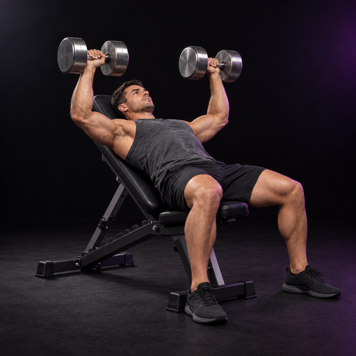

# Free-weight accessory artwork baseline

September 11, 2026 — DEV only.

**The person performing the movement is the subject.** The user's clarification replaces the initial equipment-only/no-human direction. The canonical reference is now an adult athlete performing a dumbbell incline bench press during the press, with both hands, both dumbbells, the inclined bench and planted feet visible.

## Selected reference

Two performing-athlete poses were explored: mid-press and the lowered position. Mid-press was selected because the separated arms and elevated dumbbells make the action clearer at thumbnail size. A final refinement darkened the floor and shoe soles and increased framing clearance. The preceding three equipment-only candidates and their refinements are superseded studies, not the family baseline.

| Deliverable | Location / convention |
| --- | --- |
| Original master | `assets/images/movement-artwork/free-weight-v1/masters/dumbbell-incline-bench-press-v1.png` — native generated 1254 × 1254 PNG, not upscaled |
| Card/detail asset | `assets/images/movement-artwork/free-weight-v1/dumbbell-incline-bench-press-v1.png` — 512 × 512 RGB PNG |
| Thumbnail asset | `assets/images/movement-artwork/free-weight-v1/dumbbell-incline-bench-press-v1-thumb.png` — 192 × 192 RGB PNG, selected at display sizes ≤64 points |
| Generation | Built-in `image_gen`; [performer candidate prompts](validation/free-weight-accessory-baseline-2026-09-11/performing-athlete-prompts.json), [final refinement prompt](validation/free-weight-accessory-baseline-2026-09-11/performing-athlete-final-prompt.txt) |
| Provenance | [Dimensions, byte counts, hashes and original generated path](validation/free-weight-accessory-baseline-2026-09-11/asset-manifest.json) |

Derivatives are Lanczos downsampling of the selected master. There is no crop, recoloring, upscaling, anatomical overlay or independently composed thumbnail. This extends the existing PNG asset hierarchy and canonical artwork mapping; it does not introduce a second rendering system.

## Family rules

- **Action:** show a real, recognizable phase of the exact movement. Choose the phase for readable joint/equipment relationships; avoid a generic posed athlete holding equipment. For this reference, head/back/glutes are supported, feet are planted, wrists support the handles, and both dumbbells are independently visible.
- **Camera:** moderate side/front three-quarter view with normal-to-short-telephoto perspective. Use 60–70 mm lens language, camera around seated chest height (roughly 1.0–1.2 m), and roughly 2–3 m distance adjusted to fit the action. These are generation targets, not measured camera metadata. Future movements may change the viewing angle to expose their defining action.
- **Framing:** square master; the athlete, equipment and complete motion silhouette occupy most of the frame. Aim for 8–10% clear perimeter while keeping hands/weights prominent. Never crop the head, hands, weights, feet or relevant equipment. The actual reference has tighter clearance at the far shoe; runtime uses `contain` and was inspected with its real rounded corners. Near-square frames must also contain the whole square source, not trim it with `cover`.
- **Materials:** natural skin, graphite training clothes, matte black bench upholstery, believable welded steel and clean brushed-metal dumbbells. No real manufacturer marks, lettering or invented labels. Match equipment scale, grip geometry, perspective and contact shadows.
- **Lighting:** broad soft neutral key from upper left/front, restrained violet rim from rear right, and only a trace of magenta bounce. Skin remains natural; metal and hands carry crisp highlights. Do not paint equipment purple or turn the person into an illuminated anatomy figure.
- **Background/shadow:** near-black OLED studio, faint low-contrast floor texture and soft grounded shadows. Keep the perimeter dark. No bright floor pool, gym clutter, mirrors, floating props or decorative fog.
- **Thumbnail hierarchy:** hands, weights and action silhouette should survive 42–62 point presentation. Shoes and background must not become the brightest features. Photo-frame corners scale with size, capped at the existing large radius, so tiny frames do not clip the subject into a circle.
- **Anatomy:** movement artwork depicts the movement. Muscle evidence remains in the existing Dynamic Anatomy System; no muscle coloring or evidence overlays are baked into the photograph.

For future flat press, shoulder press, row, lateral raise, curl, dumbbell RDL, Bulgarian split squat and goblet squat, retain the material/light/background language but select a camera and action phase that reveals that exact movement. None of those assets was generated or mapped in this task.

## Governed integration

The single registered key is `accessory_incline_dumbbell_bench_press`, observed as MovementDefinition **33** in canonical DEV. That stable catalog key comes from the authoritative resolved identity; display names and aliases do not select artwork. A positive canonical numeric ID and governed taxonomy remain required. The separate legacy definition **7**, `incline_dumbbell_press`, is deliberately unmapped.

The existing `resolveCanonicalMovementArtwork` resolves the effective/performed/legacy/programmed subject; `canonical-movement-artwork-assets.ts` supplies its image; `CanonicalMovementArtwork` renders it across existing consumers. Incomplete or contradictory authoritative subjects fail closed instead of falling through to a different prescription. Unrelated valid movements retain their current fallback, Core art is unchanged, and anatomy code is untouched.

## Verification

[Native evidence and test results](validation/free-weight-accessory-baseline-2026-09-11/README.md) cover canonical `npm start`, Logger card/120-point hero, Session Workspace, movement search and exact Movement History. Actual first-pass screenshots were inspected, the three weakest areas were corrected, and a second screenshot pass was inspected. No training evidence was edited during visual inspection.

**NO TESTFLIGHT. NO PRODUCTION.**
